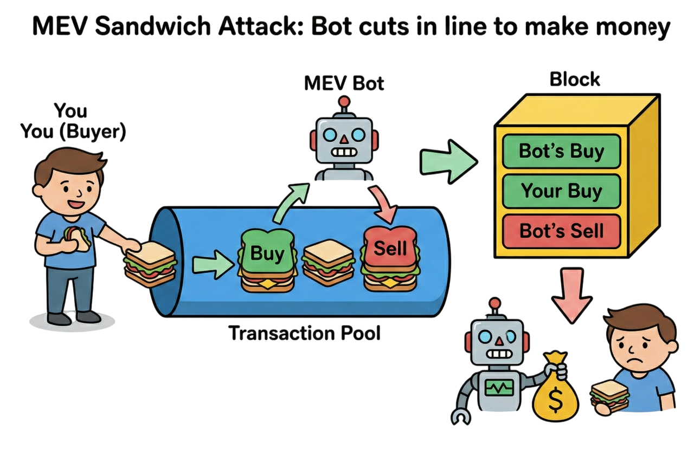

# 🛡️ SecureLiquidPool Protocol

> **The First "Sandwich-Proof" Liquid Staking Protocol & AMM on Solana.**
> Use **Commit-Reveal** technology to protect your trades and stakes from MEV bots while earning yield.



## 🚨 The Problem: MEV Sandwich Attacks

**Maximal Extractable Value (MEV)** is a hidden tax on crypto users. "Sandwich Bots" monitor the mempool for your pending transactions. When they see you buying, they:
1.  **Front-run**: Buy before you to push the price up.
2.  **Victim Trades**: You buy at the inflated price.
3.  **Back-run**: They sell immediately to profit from your loss.

According to **[Helius Reports](https://helius.dev/blog/solana-mev-sandwiches)**:
-   A single sandwich bot (Vpe...program) profited **~$13.43 Million** in just 30 days.
-   Users on Solana lose an estimated **$300M - $500M annually** to these predatory bots.

---

## ✅ The Solution: SecureLiquidPool

We solve this by **removing the target**.

SecureLiquidPool implements a **Commit-Reveal** mechanism. Instead of broadcasting your trade details (amount, direction) to the public mempool where bots can see them, you broadcast a **hashed "Commitment"**.

-   **Phase 1 (Commit)**: You hide your intent behind a cryptographic hash. Bots see *something* happened, but they don't know *what*, so they cannot sandwich you.
-   **Phase 2 (Reveal)**: After a safe delay, you reveal and execute atomically. The trade happens instantly, leaving no gap for bots to insert themselves.

---

## 💰 How You Earn

SecureLiquidPool combines the best of Liquid Staking (LSP) and Decentralized Exchanges (AMMs).

### 1. Liquid Staking (~7% APY)
Deposit `SOL` to mint **`secuSOL`**.
-   **Staking Rewards**: Your `secuSOL` value appreciates over time as the pool accrues validator rewards (approx. 7% APY detailed by Jito/Solana metrics).
-   **Liquid**: Unlike native staking, `secuSOL` is transferrable and usable in DeFi.

### 2. MEV-Free Trading
Swap between `SOL` and `secuSOL` using our custom **zero-slippage-exploitation AMM**.
-   **Fair Pricing**: Since bots can't front-run you, you get the price you see.
-   **Lower Costs**: Stop losing 1-3% slippage to invisible predators.

### 3. Liquidity Provision
Become a Liquidity Provider (LP) by depositing `SOL` + `secuSOL`.
-   **Fees**: Earn a share of every swap that happens in the pool.
-   **LP Tokens**: Receive **`secuLPT`** to track your share of the pool.

---

## 📺 See It In Action (Demo)

Watch the full application demo and technical code walkthrough:

[](https://www.youtube.com/watch?v=q_Cmnj-2DFQ)

> **Simulation Proof**: Check out our [Localnet Simulation](./mev-simulation/README.md) to see a live "Sandwich Bot" fail to attack our protocol while successfully draining a standard AMM.

---

## 📂 Project Structure

This repository contains the complete ecosystem:

| Component | Directory | Description |
| :--- | :--- | :--- |
| **Frontend** | [`/frontend`](./frontend) | Next.js 16 + Bun + Three.js web application. |
| **Smart Contracts** | [`/securelp`](./securelp) | Anchor workspace containing the 3 core programs (`securelp`, `amm`, `stake_pool`). |
| **MEV Simulation** | [`/mev-simulation`](./mev-simulation) | Verification framework to prove the protection works against live bots. |

---

## 🚀 Getting Started

### Prerequisites
-   **Bun** (Runtime & Package Manager)
-   **Solana Tool Suite**
-   **Anchor**

### Quick Start
1.  **Clone the repo**
2.  **Start Local Validator & Deploy Programs**:
    ```bash
    cd securelp
    anchor localnet
    ```
3.  **Run Frontend**:
    ```bash
    cd frontend
    bun install && bun dev
    ```

*Read the specific READMEs in each directory for detailed setup instructions.*
