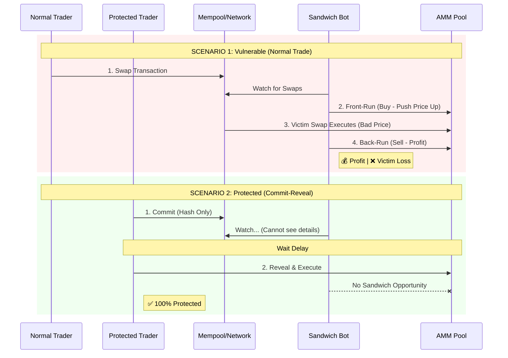

# MEV Sandwich Attack Simulation

A comprehensive framework used to **verify** and **demonstrate** that Commit-Reveal protection works against MEV Sandwich Bots.

## 🟢 1. Localnet Simulation (The "Real" Verification)
**Location**: [`localnet/`](./localnet)

This is a realistic simulation running on a **real local Solana validator**. It deploys the actual programs, creates real accounts, and runs separate "agents" for traders and attackers.

### Simulation Flowchart


### How It Works: The Orchestrator
**File**: [`localnet/src/simulation/orchestrator.ts`](./localnet/src/simulation/orchestrator.ts)

The Orchestrator loops through `N` scenarios. For each scenario, it runs TWO cases with identical parameters to compare the outcome:
1. **Normal Trade**: User sends a standard swap.
2. **Protected Trade**: User uses the commit-reveal mechanism.

```typescript
// localnet/src/simulation/orchestrator.ts

// ... inside the simulation loop ...

// TRADE 1: Normal Trading (Vulnerable)
// Attacker tries to front-run this
if (shouldAttack && this.attacker) {
    const frontRunResult = await this.attacker.executeFrontRun(pendingSwap, poolBefore);
    if (frontRunResult.success) {
        // ... victim executes at worse price ...
        // ... attacker back-runs for profit ...
    }
}

// TRADE 2: Protected Trading (Commit-Reveal)
// Attacker cannot see parameters, so they fail to sandwich
const protectedResult = await protectedTrader.commitAndReveal(amount, direction);
```

### How It Works: The Sandwich Bot
**File**: [`localnet/src/bots/sandwich-attacker.ts`](./localnet/src/bots/sandwich-attacker.ts)

The bot mimics a real MEV bot. It calculates optimal bribery/front-run amounts and executes the attack in two steps:
1. **Front-Run**: Swap in the same direction as the victim to push price up.
2. **Back-Run**: Swap back immediately after the victim to secure profit.

```typescript
// localnet/src/bots/sandwich-attacker.ts

// Step 1: Execute Front-Run
async executeFrontRun(victim: PendingSwap, pool: PoolState) {
    // Calculate optimal amount to sandwich
    const params = this.calculateSandwich(victim, pool);
    if (!params.isProfitable) return { success: false };

    // Send transaction to swap BEFORE victim
    // ...
}

// Step 3: Execute Back-Run (after victim)
async executeBackRun(params: SandwichParams, ...) {
    // Swap back to realize profit (minus fees)
    // ...
}
```

### Run Command
To run this verification on your machine:
```bash
cd localnet
bun install
bun run src/index.ts run --transactions 100
```

---

## 🔵 2. Statistical Simulation (Rust)
**Location**: Root directory (`src/main.rs`)

This is a **mathematical model** written in Rust. It does NOT use a blockchain.
- **Purpose**: To run millions of theoretical trades instantly.
- **Use Case**: Determining optimal fee structures or maximum slippage parameters to define "profitable" attack surfaces mathematically.

### Run Command
```bash
cargo run --release -- run
```
