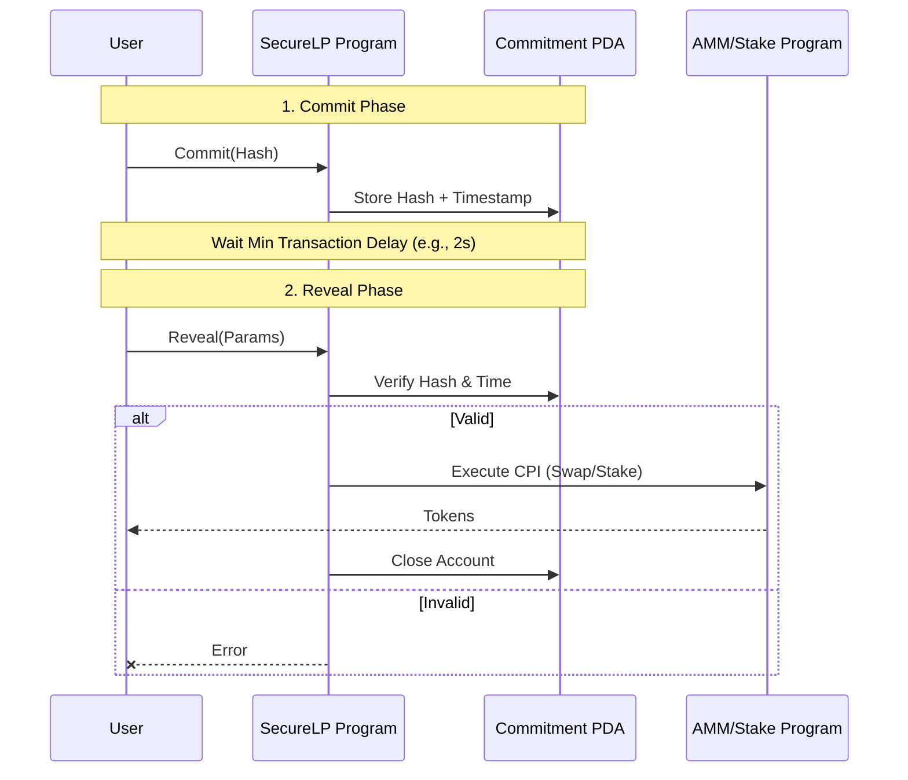
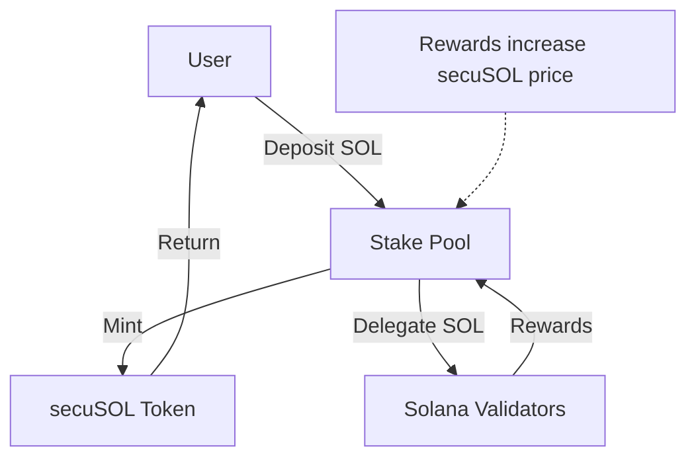

# SecureLiquidPool Solana Programs

This directory contains the core Anchor programs for the SecureLiquidPool protocol.

## 🏗️ Architecture Overview

The protocol consists of three interacting programs:
1. **SecureLP (`securelp`)**: The main entry point implementing the **Commit-Reveal** protection mechanism.
2. **AMM (`amm`)**: A constant-product Automated Market Maker (CPMM) for swapping tokens (`wSOL` / `secuSOL`).
3. **Stake Pool (`stake_pool`)**: A liquid staking pool that mints `secuSOL` in exchange for SOL.

---

## 🔒 1. Main Program: SecureLP (Commit-Reveal)
**File Location**: [`programs/securelp/src/lib.rs`](./programs/securelp/src/lib.rs)

This program acts as a proxy/shield. Users interact with *this* program instead of the AMM or Stake Pool directly. It enforces the "Commit-Wait-Reveal" flow to prevent sandwich attacks.

### Flowchart


### Key Logic: Code Snippet
1. **Commit**: User submits a hash of their trade parameters.
   ```rust
   // programs/securelp/src/lib.rs

   pub fn commit(
       ctx: Context<Commit>,
       hash: [u8; 32], // Blinded hash of intent
       amount_lamports: u64,
       is_stake: bool,
   ) -> Result<()> {
       // ...
       let commitment = &mut ctx.accounts.commitment;
       commitment.user = ctx.accounts.user.key();
       commitment.hash = hash;
       commitment.timestamp = Clock::get()?.unix_timestamp; // Start the timer
       // ...
   }
   ```

2. **Reveal & Execute**: After a delay (e.g., 1 slot/2 seconds), user reveals details. The program verifies the hash and executes the inner instruction (Swap/Stake) via CPI (Cross-Program Invocation).
   ```rust
   // programs/securelp/src/lib.rs

   pub fn reveal_and_swap(
       ctx: Context<RevealAndSwap>,
       details: SwapDetails, // Revealed details
       a_to_b: bool,
   ) -> Result<()> {
       // 1. Verify Minimum Delay
       require!(
           clock.unix_timestamp >= commitment.timestamp + config::MIN_DELAY_SECONDS,
           SecureLPError::DelayNotMet
       );

       // 2. Verify Hash Matches
       require!(
           computed_hash == commitment.hash,
           SecureLPError::HashMismatch
       );

       // 3. Execute AMM Swap via CPI
       let cpi_program = ctx.accounts.amm_program.to_account_info();
       // ... calls amm_swap() ...
   }
   ```

---

## 💱 2. AMM Program (Automated Market Maker)
**File Location**: [`programs/amm/src/lib.rs`](./programs/amm/src/lib.rs)

Standard Constant Product Market Maker ($x * y = k$). It allows swapping between Token A (e.g., wSOL) and Token B (e.g., `secuSOL`). Liquidity providers earn fees and receive `secuLPT` tokens.

### Flowchart
```mermaid
graph LR
    User[User] -->|1. Swap Input| AMM[AMM Program]
    AMM -->|2. Calc Output (xy=k)| Logic{Constant Product}
    Logic -->|3. Update Reserves| State[(Pool State)]
    State -->|4. Transfer| Vaults[Token Vaults]
    Vaults -->|5. Output Token| User
```

### Key Logic: Swap
Calculates the output amount based on the constant product formula and fees.
```rust
// programs/amm/src/lib.rs

pub fn swap(
    ctx: Context<Swap>,
    amount_in: u64,
    min_amount_out: u64,
    a_to_b: bool,
) -> Result<()> {
    // ...
    // Calculate output amount (Constant Product)
    let (amount_out, fee_amount) = pool.calculate_swap_output(amount_in, a_to_b)?;
    
    // Transfer tokens
    if a_to_b {
         // Transfer A from User -> Vault
         // Transfer B from Vault -> User
    } else {
         // ...
    }
    // ...
}
```

---

## 🥩 3. Stake Pool Program (Liquid Staking)
**File Location**: [`programs/stake_pool/src/lib.rs`](./programs/stake_pool/src/lib.rs)

Manages the SOL liquidity. Users deposit SOL to receive `secuSOL` (liquid token) representing their share of the pool. The pool delegates SOL to validators to earn rewards, increasing the value of `secuSOL` over time.

### Flowchart


### Key Logic: Deposit SOL
Updates the pool's total stake and mints share tokens.
```rust
// programs/stake_pool/src/lib.rs

pub fn deposit_sol(ctx: Context<DepositSol>, amount_lamports: u64) -> Result<()> {
    // ...
    // Calculate secuSOL to mint based on current exchange rate
    let slp_to_mint = pool.calculate_slp_for_deposit(amount_lamports)?;

    // Transfer SOL: User -> Reserve Vault
    system_program::transfer(cpi_context, amount_lamports)?;

    // Mint secuSOL: Pool -> User
    token::mint_to(cpi_ctx, slp_to_mint)?;
    // ...
}
```

---

## 🚀 Setup & Build

### 1. Install Dependencies
```bash
bun install
```

### 2. Build Information
```bash
anchor build
```
This generates:
- **IDL**: `target/idl/` (JSON descriptions of programs)
- **Types**: `target/types/` (TypeScript definitions)

### 3. Run Tests
```bash
anchor test
```

## 🧪 Localnet Testing
To allow the frontend to connect, run a local validator with the programs deployed:
```bash
anchor localnet
```
